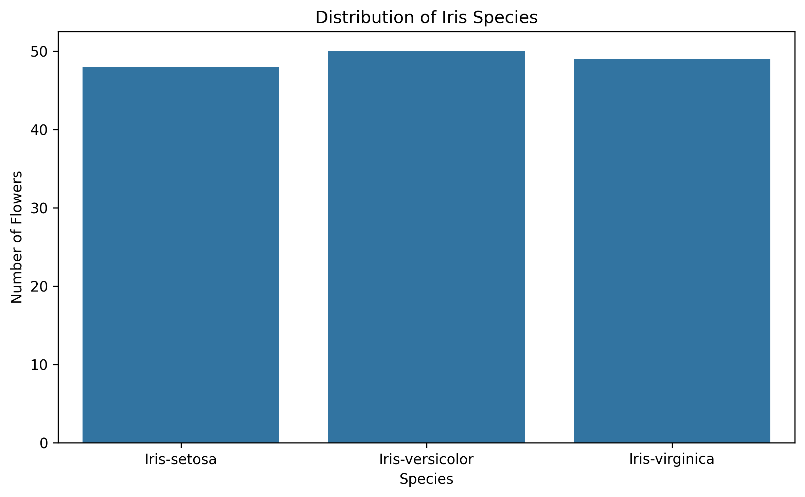
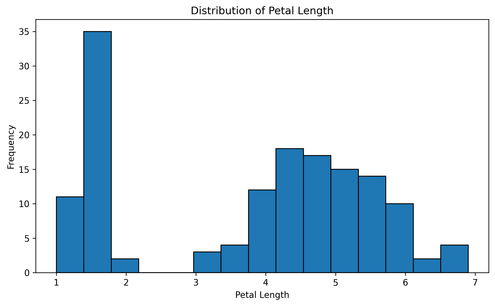
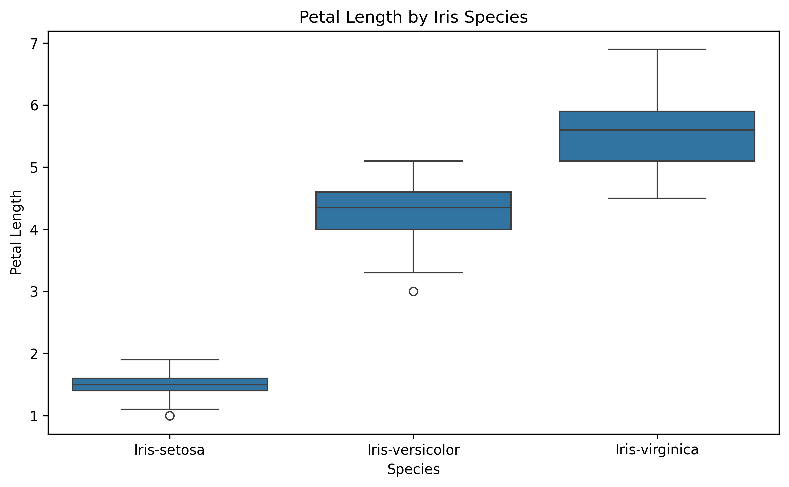
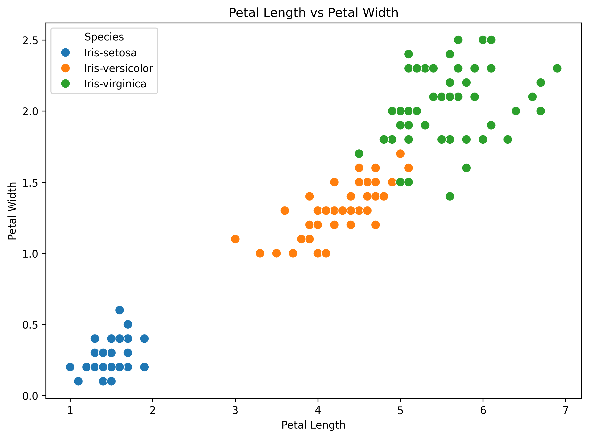
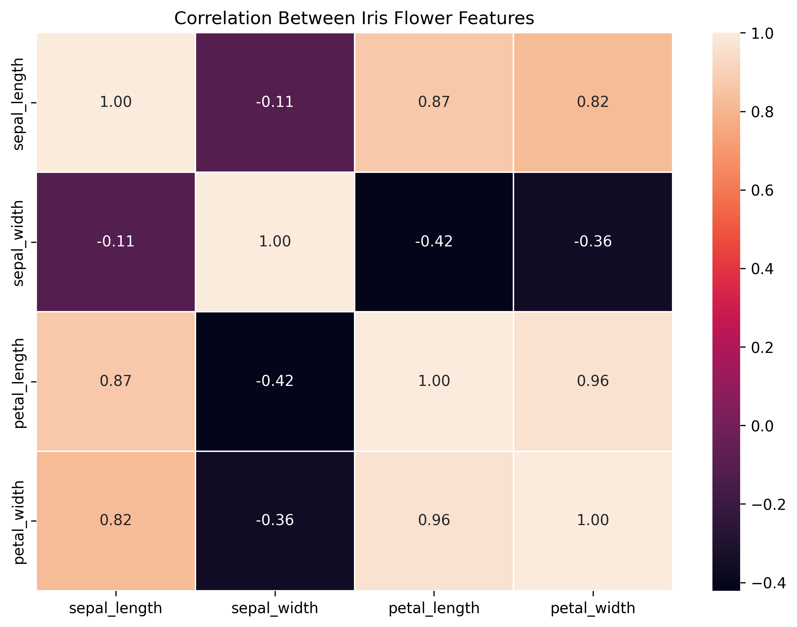
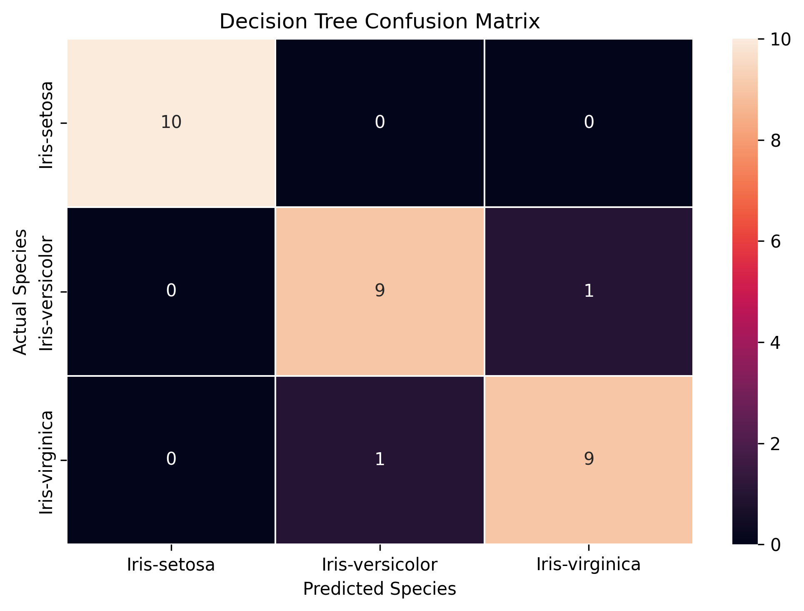
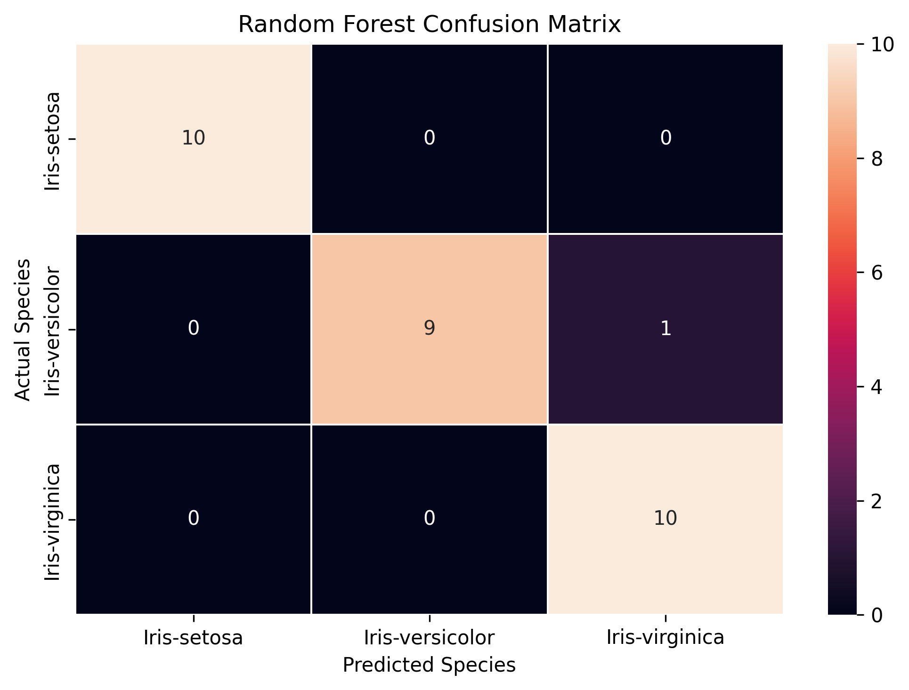
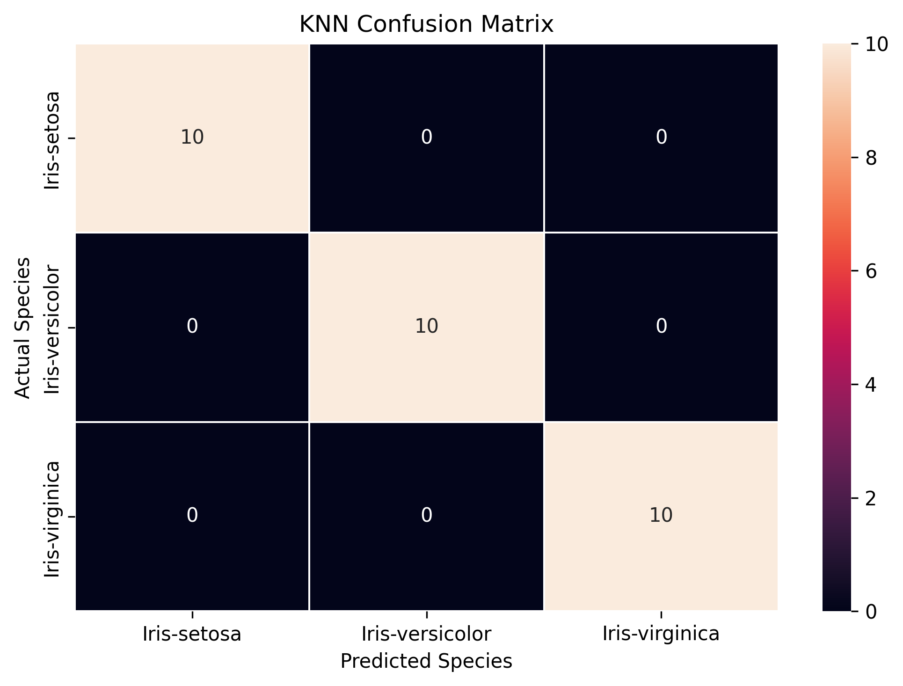

# Iris Flower Classification

> SystemTron Data Science Internship — Week 4

[](https://www.python.org/) [](https://scikit-learn.org/)

This project classifies Iris flowers as **Iris-setosa**, **Iris-versicolor**, or **Iris-virginica** from four sepal and petal measurements. It was completed for the Week 4 Iris Flower Classification task in the SystemTron Data Science Internship.

## Problem statement

Develop a machine-learning model that learns from flower measurements and predicts the corresponding Iris species.

## Objectives

- Prepare the supplied Iris dataset for modelling.
- Explore the class distribution and relationships among numerical features.
- Train and compare Decision Tree, Random Forest, and K-Nearest Neighbors (KNN) classifiers.
- Persist the selected model and record a sample prediction.

## Dataset

- **Source:** [Iris Flower Dataset on Kaggle](https://www.kaggle.com/datasets/arshid/iris-flower-dataset)
- **Raw file:** [`data/raw/IRIS.csv`](data/raw/IRIS.csv)
- **Original shape:** 150 rows × 5 columns
- **Missing values:** 0
- **Duplicate rows:** 3 before cleaning; 0 after cleaning
- **Cleaned file:** [`data/processed/iris_dataset_cleaned.csv`](data/processed/iris_dataset_cleaned.csv)
- **Cleaned shape:** 147 rows × 6 columns (the original five columns plus `species_encoded`)

### Variables

| Role | Columns |
| --- | --- |
| Numerical features | `sepal_length`, `sepal_width`, `petal_length`, `petal_width` |
| Target | `species` |
| Encoded target | `species_encoded` |

The target encoding is `Iris-setosa = 0`, `Iris-versicolor = 1`, and `Iris-virginica = 2`. The modelling feature matrix has shape **(147, 4)** and the target vector has shape **(147,)**.

## Data preparation

The workflow checks for missing values, removes duplicate records, retains the four numerical measurement columns as predictors, and encodes the `species` target. After duplicate removal, the dataset contains 147 records.

## Exploratory data analysis

The notebook examines the cleaned data through species counts, a petal-length distribution, petal length by species, the relationship between petal length and petal width, and correlations between numerical features.

### Species Distribution



All three Iris species are represented in the cleaned dataset, with 48 Iris-setosa records, 50 Iris-versicolor records, and 49 Iris-virginica records after duplicate removal.

### Feature Distribution



The notebook visualizes the distribution of petal length to show its range and frequency in the cleaned dataset.

### Petal Length by Species



The boxplot compares petal-length distributions across the three species; the notebook uses this comparison to examine variation by class.

### Petal Length vs Petal Width



The scatter plot shows petal length against petal width, coloured by species, to examine the relationship between these two measurements across classes.

### Feature Correlation



The correlation heatmap shows strong positive relationships between petal measurements, including petal length and petal width.

## Modelling methodology

The cleaned data is split with `test_size=0.20`, `random_state=42`, and `stratify=y`, producing 117 training records and 30 held-out test records. Performance is compared using accuracy, weighted precision, weighted recall, and weighted F1-score.

| Model | Hyperparameters used |
| --- | --- |
| Decision Tree Classifier | `random_state=42` |
| Random Forest Classifier | `n_estimators=100`, `random_state=42` |
| K-Nearest Neighbors | `n_neighbors=5` |

## Results

The recorded evaluation results are stored in [`models/model_comparison.csv`](models/model_comparison.csv).

| Model | Accuracy | Precision | Recall | F1-score |
| --- | ---: | ---: | ---: | ---: |
| Decision Tree | 0.933333 | 0.933333 | 0.933333 | 0.933333 |
| Random Forest | 0.966667 | 0.969697 | 0.966667 | 0.966583 |
| KNN | 1.000000 | 1.000000 | 1.000000 | 1.000000 |

### Best model: KNN

KNN was selected because it achieved the strongest recorded scores: **100% on the 30-record held-out test dataset used in this project**. This result is specific to this split and should not be interpreted as universal accuracy on all Iris data.

### Confusion Matrices



The Decision Tree correctly classified all 10 Iris-setosa test records; it misclassified one Iris-versicolor and one Iris-virginica record.



The Random Forest correctly classified all Iris-setosa records and made one error between Iris-versicolor and Iris-virginica.



KNN correctly classified all 30 held-out test records, with no errors in its confusion matrix.

## Sample prediction

The persisted KNN model predicts **Iris-virginica** for the following flower:

| Sepal length | Sepal width | Petal length | Petal width | Predicted species |
| ---: | ---: | ---: | ---: | --- |
| 5.9 | 3.0 | 5.1 | 1.8 | Iris-virginica |

The recorded output is available in [`models/new_flower_prediction.csv`](models/new_flower_prediction.csv).

## Model persistence

The selected trained model is saved as [`models/iris_knn_model.pkl`](models/iris_knn_model.pkl).

## Project structure

```text
Iris_Flower_Classification_Week_4/
├── data/
│   ├── raw/
│   │   ├── iris-flower-dataset.zip
│   │   └── IRIS.csv
│   └── processed/
│       └── iris_dataset_cleaned.csv
├── models/
│   ├── iris_knn_model.pkl
│   ├── model_comparison.csv
│   └── new_flower_prediction.csv
├── notebooks/
│   └── Iris_Flower_Classification.ipynb
├── reports/
│   └── Iris_Flower_Classification_Report.md
├── results/
│   ├── 01_species_distribution.png
│   ├── 02_feature_distribution.png
│   ├── 03_petal_length_boxplot.png
│   ├── 04_petal_length_vs_width.png
│   ├── 05_correlation_heatmap.png
│   ├── 06_decision_tree_confusion_matrix.png
│   ├── 07_random_forest_confusion_matrix.png
│   └── 08_knn_confusion_matrix.png
├── README.md
├── requirements.txt
└── .gitignore
```

## Technology stack

Python, pandas, NumPy, Matplotlib, Seaborn, scikit-learn, joblib, and Jupyter Notebook.

## Installation

```bash
git clone <repository-url>
cd Iris_Flower_Classification_Week_4
python -m venv .venv
```

Activate the virtual environment, then install the dependencies:

```bash
pip install -r requirements.txt
```

## Run the notebook and reproduce the workflow

```bash
jupyter notebook notebooks/Iris_Flower_Classification.ipynb
```

The notebook contains a Kaggle API download-and-extract step that creates the local raw dataset file [`data/raw/IRIS.csv`](data/raw/IRIS.csv). The project uses this Kaggle-provided dataset from the raw data directory; running the notebook reproduces the data loading, preprocessing, exploratory analysis, visualization, model training, evaluation, prediction, and artifact-generation workflow.

## Key findings

- Removing three duplicate rows reduced the raw dataset from 150 to 147 records.
- The three evaluated classifiers all achieved strong scores on the held-out split.
- KNN produced the highest recorded held-out-test performance for this project.

## Limitations and future improvements

- Results come from one 30-record hold-out test set; use cross-validation to obtain a more robust performance estimate.
- The data is small and limited to three Iris classes, so conclusions should not be generalized beyond this task without further validation.
- Add cross-validation, feature-scaling experiments for KNN, and hyperparameter tuning to assess whether the selected settings remain best under broader evaluation.

## Project status

Completed internship project. Documentation, artifact references, and the executable notebook workflow have been audited.

## Author

**SIDDIQUE H**

Data Science Intern | Data Analytics & Machine Learning

This project was developed as part of the **SystemTron Data Science Internship — Week 4**.
